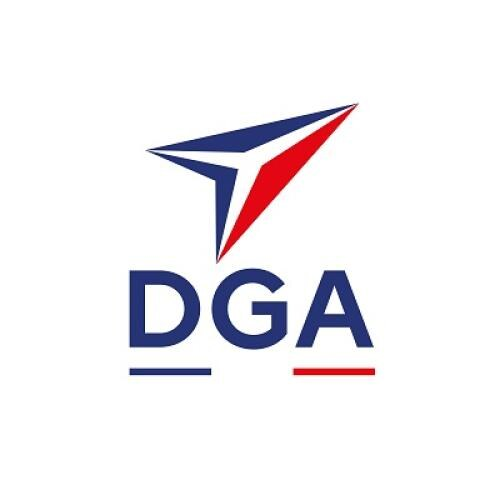

Cette saison, la **Team Opossum** a eu la chance d'être soutenue par la **DGA** (Direction générale de l'armement). Un grand merci à eux !

Grâce à leur soutien, nous avons pu équiper nos robots de matériel de qualité :

- les **lidars** de nos PAMI qui leur permet de se repérer sur la table et d'éviter les adversaires,
- **2 caméras JeVois Pro** pour le robot principal qui nous permettent de localiser les éléments de jeux dans toutes les directions pour une plus grande efficacité en match,
- les **servomoteurs** numériques pour les huits pinces du robot principal.
- ainsi que divers éléments mécaniques (roues, makerbeam etc)

Autant de composants essentiels qui ont directement contribué aux performances de nos machines pendant la Coupe de France de Robotique 2026. Merci encore à la DGA pour sa confiance et son engagement auprès des jeunes passionnés de robotique !

