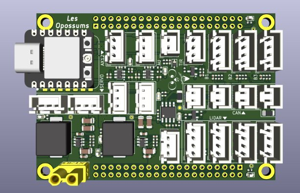
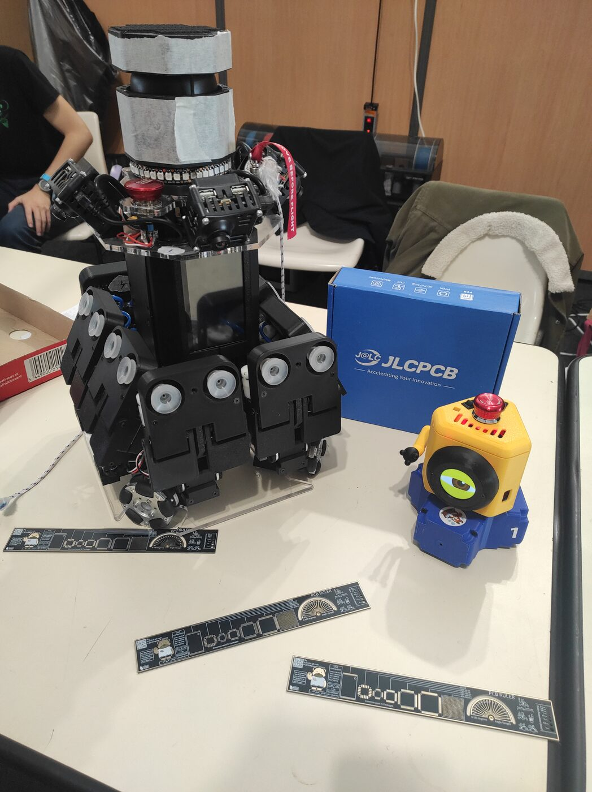

We're thrilled to welcome a new partner on board: **JLCPCB France**!

We had the chance to chat with their team during the **French Robotics Cup**, and that meeting grew into a great partnership for our upcoming projects.

# Who is JLCPCB?
JLCPCB is one of the world's largest **printed circuit board (PCB)** manufacturers. They offer a fast, reliable and affordable **PCB manufacturing and assembly** service — turning a schematic into a fully assembled board in just a few days.

# Why it matters to us
Every year the Cup's rules change, and our robots change with them. To keep up, we design **many electronic boards** each season: new bases, new actuators, new revisions of our existing boards.

That's where **JLCPCB** makes all the difference: their service is **very fast** and offers **excellent manufacturing quality**. We get fully assembled, ready-to-use boards within days — far more compact and reliable than hand-made wiring. The result: fewer failures in competition, a huge time saving, and the freedom to focus on design.

_Our new Zynq-7000 board (v2), currently in preparation._

# Our board projects
This partnership comes at the perfect time, as we have several boards in the pipeline:

- a **v2 of the Zynq-7000 motherboard** for the main robot,
- a **v2 of the SIMA boards**,
- and various **actuator boards**, to be designed according to next season's rules.

A huge thank you to **JLCPCB** for their trust and support. We can't wait to show you our next boards!

