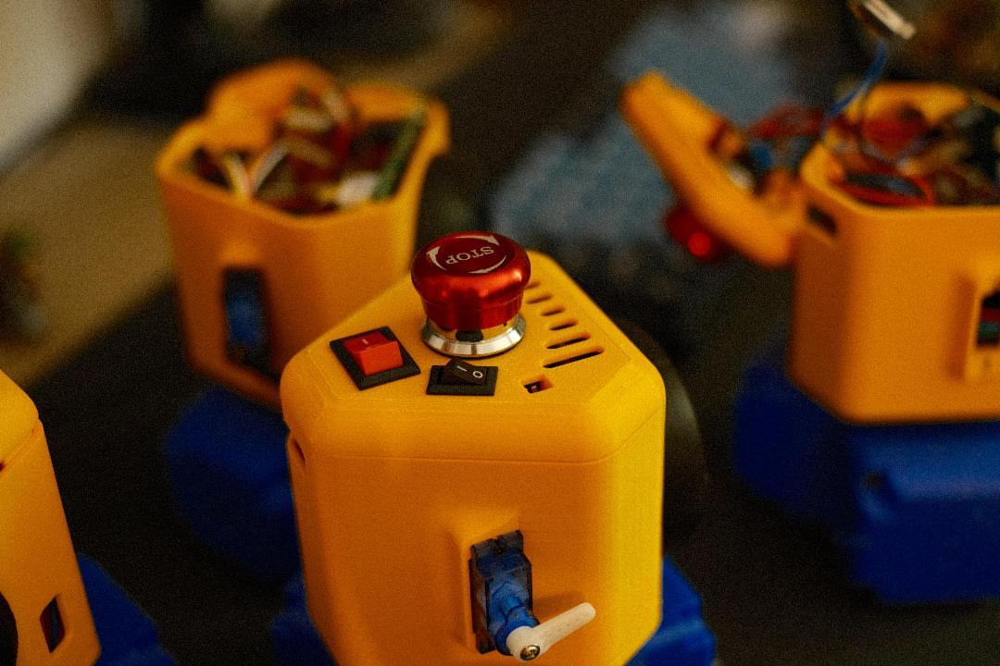
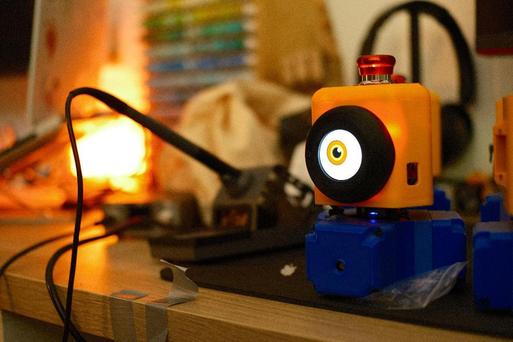

Here are **Team Opossum's very first SIMAs**! These small autonomous robots took on the look of **minions** — a small, deliberate nod away from our team theme.

Technically, they are **3-wheel holonomic** robots, which lets them move freely in any direction. They are **entirely 3D-printed**, wheels included.

To find their way, each SIMA uses an **LD06 lidar** that provides absolute localization based on the table borders. Everything is driven by a **Raspberry Pi Pico 2W**.

A first generation we're proud of, and a great base for what's next!

