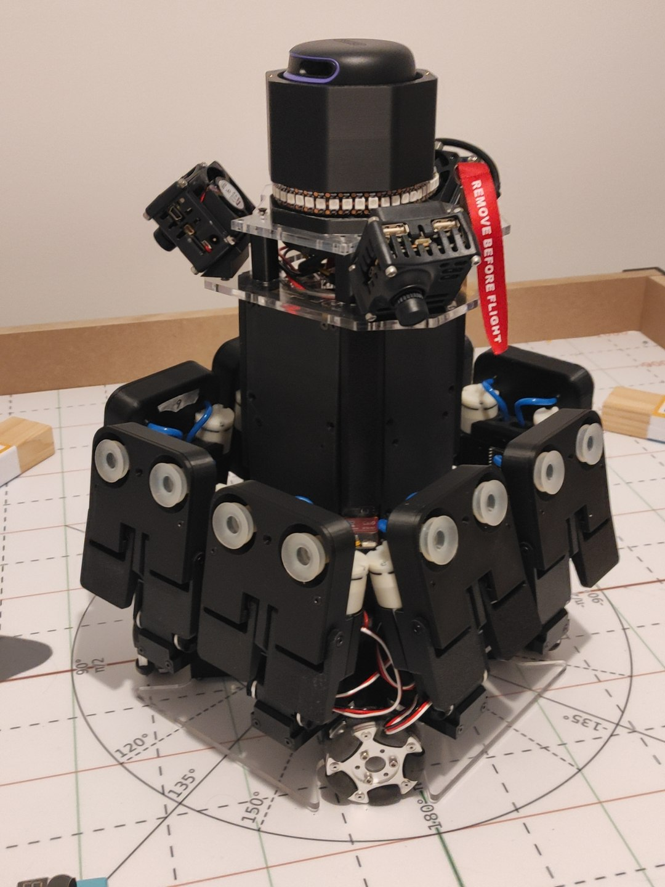

Voici le **robot principal de la Team Opossum** pour la Coupe de France de Robotique 2026.

C'est un robot **holonome à 4 roues**, entraîné par des moteurs **M2006 P36** qui lui permettent d'atteindre **1,5 m/s** — de quoi se déplacer vite et dans toutes les directions.

# Se repérer et voir le jeu
Pour la navigation, il embarque un **lidar A2M12** utilisé à la fois pour l'**évitement de l'adversaire** et pour la **localisation par triangulation sur les balises fixes**.

Afin de repérer les éléments de jeu de l'édition 2026, il dispose également de **trois caméras JeVois Pro**.

# L'électronique
Le robot s'appuie sur deux cerveaux complémentaires : un **Raspberry Pi 4** pour la stratégie haut niveau, et un **Zynq-7000** dédié à l'asservissement et à la gestion des actionneurs.

# La préhension
Côté manipulation, il est équipé de **8 pinces à ventouses**, capables d'attraper et de retourner les « jenga » du règlement.

# Des scripts de match dynamiques
Autre grande nouveauté pour nous cette année : la mise en place de **scripts de match totalement dynamiques**. Plutôt que de suivre une séquence figée, le robot **s'adapte intelligemment à ce qu'il se passe pendant le match** et choisit ses actions en fonction de la situation.

Un robot complet et polyvalent, pensé pour jouer de manière autonome et opportuniste !

